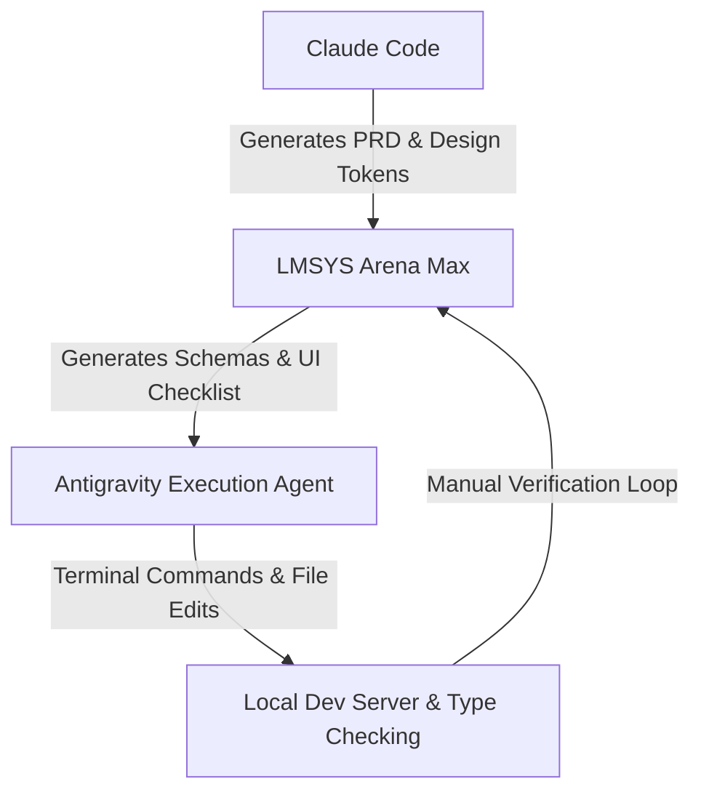

# Multi-Agent AI Development & Orchestration Workflow

This document details the multi-agent AI engineering workflow used to design, implement, audit, and polish the Flatmates Expense Tracker. Rather than relying on a single AI model, this project leveraged a specialized pipeline of agentic tools, structured prompts, and automated verification loops.

---

## 1. Multi-Agent Orchestration Architecture

To achieve high-quality results across both backend architecture and visual presentation, the development process was organized into a multi-agent pipeline:



### Agent Roles & Specialized Tasks:

1. **Claude Code (Product & Style Architect)**:
   * **Role**: Initial requirements gathering and design system creation.
   * **Outputs**: Generated the foundational Product Requirement Document (`PRD.md`), functional bounds (`SCOPE.md`), and defined the primary color tokens and styling guidelines.

2. **LMSYS Chat Arena - Max Model (System Architect & Auditor)**:
   * **Role**: Central design planning, backend mapping, deployment scripting, and testing.
   * **Tasks**:
     * Designed SQL schemas and timeline-aware balance calculation math.
     * Structured the 17-detector CSV import parser pipeline.
     * Conceived UI/UX animation plans (floating cards, spring-animated SVG logo, circular network graph coordinate math).
     * **Verification Checklist Generation**: Wrote strict verification prompts for each phase to lock down progress before initiating edits.

3. **Antigravity (DeepMind Execution Agent)**:
   * **Role**: Local workspace execution agent.
   * **Tasks**:
     * Directly executed code modifications (Framer Motion additions, client components, API routes) inside the workspace.
     * Managed system tasks (database migrations, dependency installs, Next.js build runs).
     * Handled automated Type-safety checks (`npx tsc --noEmit`) to catch compiling errors.

---

## 2. Iterative Feedback & Verification Loop

The implementation followed a rigorous loop structure to guarantee zero regressions on existing business logic:

1. **Promoting to LM Arena Max**: Provided LM Arena Max with context files (PRD, schemas, layouts).
2. **Strategy Prompting**: LM Arena Max generated implementation scripts, CSS keyframes, or Math equations (such as the polar formula $\theta = \frac{2\pi \cdot i}{N} - \frac{\pi}{2}$ to position avatars in the network circle).
3. **Execution via Antigravity**: Prompts and generated code segments were piped directly to Antigravity inside the local workspace to apply changes.
4. **Manual Verification**: After each file save, the developer manually reviewed the output in the web browser.
5. **Phase Gate Audits**: Before proceeding to subsequent development sections, LM Arena Max wrote a detailed validation checklist (such as checking card gradients, sparklines, confetti triggers, and edge thicknesses) to verify everything worked perfectly.

---

## 3. Concrete Cases of AI Errors, Detection, & Fixes

Even with multiple agents, errors occurred. Below are three real-world cases of AI mistakes, how the developer identified them, and the corrective actions taken:

### Case 1: Duplicate JSX `className` Attribute
* **The Error**: During the visual update of the Settlements Network Graph (`components/settlements/network-graph.tsx`), the generated code contained two duplicate `className` attributes inside the avatar `<g>` group node:
  ```tsx
  <g
    key={node.name}
    className="cursor-pointer"
    ...
    className="transition-all duration-300"
  >
  ```
* **How It Was Caught**: Antigravity triggered a Next.js production build (`npm run build`) which failed during TypeScript compilation, pointing to the exact line with:
  ```bash
  Type error: JSX elements cannot have multiple attributes with the same name.
  ```
* **What Was Changed**: Combined the duplicate attributes into a single unified class:
  ```tsx
  className="cursor-pointer transition-all duration-300"
  ```

### Case 2: PgBouncer Protocol Hangs during Multi-Statement DDL
* **The Error**: The initial migration SQL generated by LM Arena Max was executed as a single multi-statement transaction over port `6543` (transaction mode).
* **How It Was Caught**: In transaction mode, executing multi-statement SQL strings causes PgBouncer to hang indefinitely or throw protocol errors since transactions cannot hold state across multiple raw statements.
* **What Was Changed**:
  1. Switched migration connection strings to port `5432` (Session Mode) specifically for DDL operations.
  2. Modified the `scripts/migrate.js` script to dynamically split queries on semicolons, strip SQL comments, and run them sequentially.

### Case 3: Invalid Seed UUID Hexadecimal Syntax
* **The Error**: The AI-generated SQL seeds contained a placeholder UUID containing an invalid hexadecimal character: `"g0000000-0000-0000-0000-000000000000"` (the letter `'g'` is outside standard hex `[0-9a-f]`).
* **How It Was Caught**: Executing the database seed script failed with a raw Postgres parsing error:
  ```bash
  invalid input syntax for type uuid: "g0000000-0000-0000-0000-000000000000"
  ```
* **What Was Changed**: Mapped the placeholder back to a valid zero-UUID format (`00000000-0000-0000-0000-000000000000`) across all schemas and session files.
