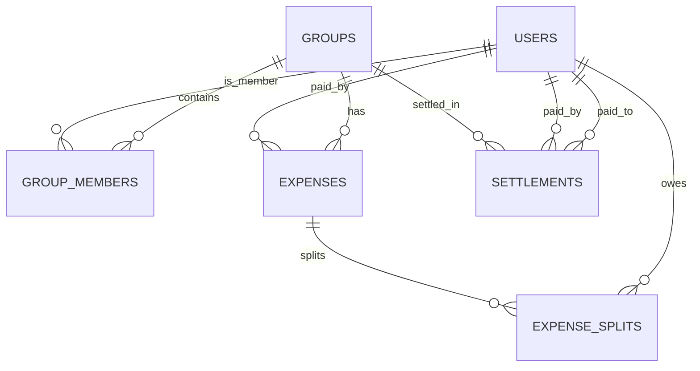

# Project Scope, Database Schema, & CSV Anomaly Log

This document outlines the functional boundaries, database schema architecture, and the detailed CSV anomaly log for the Flatmates Expense Tracker.

---

## 1. Functional Scope

### In Scope
* **Timeline-Aware Ledger Calculations**: Expenses are only split among group members active on the expense date (based on `joined_at` and `left_at` date ranges).
* **Multi-Currency Engine**: Safe conversion of USD to INR with exchange rates locked at creation/import time. Internal ledger computations are cached in INR.
* **CSV Import Pipeline**: raw parsing, intermediate storage of raw rows, pipeline execution of 17 distinct anomaly detectors, an interactive correction dashboard, and final transactional commit.
* **Debt Simplification**: Greedy transaction minimizer algorithm that computes the absolute fewest payments needed to balance the group ledger.
* **Premium Theme Design**: Glassmorphic layout, dynamic SVG sparklines, flowing cash vectors, and page load transitions.

### Out of Scope
* **External API Integration**: Live foreign exchange rates are excluded; rates are entered manually to maintain ledger predictability and historical accuracy.
* **Floating-Point Currencies**: All database/JS/TS internal operations work in integer cents (e.g., ₹12.50 = `1250`) to avoid floating-point drift.
* **Hard Deletions**: Deletions are soft-deletes via a `deleted_at` timestamp column to ensure auditability.
* **Real UPI/Gateways**: Financial settlements are recorded manually on the UI and do not make external bank calls.

---

## 2. Database Schema

The schema utilizes raw PostgreSQL tables designed with appropriate foreign keys, timestamps, and indexes to optimize performance.

### Table Structure Detail

#### `users`
* `id` (UUID PK): Primary Identifier.
* `email` (TEXT UNIQUE): Login email.
* `name` (TEXT): Display name.
* `password_hash` (TEXT): Hashed bcrypt credential.
* `avatar_color` (TEXT): Hex code for custom avatars.
* `avatar_url` (TEXT): Link to dynamic DiceBear SVG avatar.

#### `groups`
* `id` (UUID PK): Primary Identifier.
* `name` (TEXT): Group name.
* `created_by` (UUID FK -> `users.id`)
* `created_at` (TIMESTAMPTZ)
* `deleted_at` (TIMESTAMPTZ): Soft delete marker.

#### `group_members`
* `id` (UUID PK)
* `group_id` (UUID FK -> `groups.id`)
* `user_id` (UUID FK -> `users.id`)
* `joined_at` (DATE): Start date of active membership.
* `left_at` (DATE, NULLABLE): End date of active membership (NULL = currently active).
* *Constraint*: `UNIQUE(group_id, user_id, joined_at)`

#### `expenses`
* `id` (UUID PK)
* `group_id` (UUID FK -> `groups.id`)
* `description` (TEXT)
* `total_amount` (NUMERIC(10,2)): Original amount.
* `currency` (TEXT): `'INR'` or `'USD'`.
* `exchange_rate_to_inr` (NUMERIC(10,4)): Locked conversion rate.
* `total_amount_inr` (NUMERIC(10,2)): Converted stored amount.
* `paid_by_user_id` (UUID FK -> `users.id`)
* `split_type` (TEXT): `'equal'`, `'exact'`, `'percentage'`, or `'shares'`.
* `expense_date` (DATE)
* `category` (TEXT)
* `notes` (TEXT)
* `is_settlement` (BOOLEAN): Defaults to `false`.
* `import_row_id` (UUID FK -> `import_rows.id`, NULLABLE)
* `created_at` (TIMESTAMPTZ)
* `deleted_at` (TIMESTAMPTZ): Soft delete.

#### `expense_splits`
* `id` (UUID PK)
* `expense_id` (UUID FK -> `expenses.id`)
* `user_id` (UUID FK -> `users.id`)
* `share_amount` (NUMERIC(10,2)): Value if splitting exactly.
* `share_percentage` (NUMERIC(5,2)): Value if splitting by percentage.
* `share_units` (INTEGER): Value if splitting by shares.
* `amount_owed_inr` (NUMERIC(10,2)): Final converted value in INR.

#### `settlements`
* `id` (UUID PK)
* `group_id` (UUID FK -> `groups.id`)
* `paid_by_user_id` (UUID FK -> `users.id`)
* `paid_to_user_id` (UUID FK -> `users.id`)
* `amount_inr` (NUMERIC(10,2))
* `settled_at` (DATE)
* `notes` (TEXT)

---

## 3. CSV Anomaly Log & Handlers

Below is the list of all **17 unique data problems (anomalies)** detected in uploaded CSV files (e.g. `Expenses Export.csv`), with concrete examples and how the import engine handles them:

| # | Anomaly Type | CSV Example | How It's Detected | Resolution Handler |
|---|---|---|---|---|
| **1** | `DUPLICATE_EXACT` | Two rows with identical date, payer, amount, description: `"08-02-2026,Dinner Marina Bites,Dev,3200,INR"` | Matches hash of raw parameters on the same upload session. | Automatically skips the duplicate row, keeping only the first instance. |
| **2** | `DUPLICATE_CONFLICT` | Row 1: `"Goa dinner, Aisha, 2400, INR"`; Row 2: `"Thalassa dinner, Rohan, 2450, INR"` | Scans for overlapping dates, similar description patterns, and near amounts. | Flags card for manual choice in Anomaly Review UI. User can approve either or skip. |
| **3** | `SETTLEMENT_AS_EXPENSE` | `"Rohan paid Aisha back, Rohan, 5000, INR, Aisha"` | Regex search on description keywords (e.g., `paid back`, `settle`, `refund`). | Automatically converts category to `settlement` and creates a settlement ledger entry instead of an expense. |
| **4** | `MISSING_PAID_BY` | `"House cleaning supplies,,780,INR,equal..."` (Missing payer) | Checks if the `paid_by` column resolves to an empty value. | Flags as an **Error**. Blocks pipeline commit until user assigns a valid payer in the UI. |
| **5** | `MISSING_CURRENCY` | `"Groceries DMart,Priya,2105,,equal..."` (Missing currency) | Checks if the `currency` string is empty or null. | **Warning**: Auto-defaults currency to `'INR'` (group base currency). |
| **6** | `AMOUNT_FORMAT_ERROR` | `"Electricity Feb,Aisha,\"1,200\",INR"` (Number with comma) | Non-numeric characters matched during parsing. | Cleans string automatically (strips commas, quotes, spaces) to yield valid numeric `1200.00`. |
| **7** | `AMOUNT_PRECISION_ERROR` | `"Cylinder refill,Rohan,899.995,INR"` (3 decimal digits) | Checks if fractional cents exist (`amount * 100` yields floating decimal). | **Warning**: Rounds value to two decimal places (e.g., `900.00` INR) automatically. |
| **8** | `UNKNOWN_PERSON` | `"Groceries DMart,Priya S,1875,INR"` (`Priya S` not in group) | Queries the `group_members` names for exact matches. | Checks for fuzzy matches or maps name manually via a dropdown in the review UI. |
| **9** | `PERCENTAGE_SUM_ERROR` | `"Pizza, Aisha 30%; Rohan 30%; Priya 30%; Meera 20%"` (Sums to 110%) | Computes sum of split percentage tokens in split details. | **Error**: Blocks commit until user modifies percentages to equal exactly 100% in review. |
| **10** | `NEGATIVE_AMOUNT` | `"Parasailing refund,Dev,-30,USD"` (Negative refund) | Checks if value is strictly less than 0. | Treated as a negative expense (reducing balances) or flag to verify transaction direction. |
| **11** | `ZERO_AMOUNT` | `"Dinner order Swiggy,Priya,0,INR"` | Amount parsed is exactly `0`. | **Warning**: Recommends row skipping. |
| **12** | `AMBIGUOUS_DATE` | `"Mar-14,Airport cab,rohan,1100"` (Text month string) | Failed match on standard `YYYY-MM-DD` or `DD-MM-YYYY` formats. | Standardizes string dynamically using a lookup of month abbreviations (`Mar` -> `03`). |
| **13** | `NONMEMBER_IN_SPLIT` | `"Parasailing, Kabir, equal" ` (`Kabir` is not a member of the group) | Cross-checks names in split columns with the active group roster. | **Error**: Blocks commit. User must remove the non-member or map to an active member. |
| **14** | `MEMBER_INACTIVE_ON_DATE` | `"April rent, Meera split"` (`Meera` left group in March) | Compares expense date against members' `joined_at` and `left_at` bounds. | Automatically excludes the inactive member from the split on that date, re-dividing among active ones. |
| **15** | `SPLIT_TYPE_MISMATCH` | `"Furniture, equal, Aisha 1; Rohan 1; Priya 1; Sam 1"` (Equal split has shares details) | Compares split type with format of split details. | Automatically aligns data formatting, prioritizing the split detail tokens. |
| **16** | `MISSING_EXCHANGE_RATE` | `"villa booking,Dev,540,USD"` (USD expense, no rate specified) | Checks if currency is `USD` but no rate column or value is found. | **Error**: Demands user input of locked conversion rate in review UI before allowing database commit. |
| **17** | `SHARES_SUM_ERROR` | Shares split detail sums to 0. | Checks if sum of split units is 0. | Defaults split to equal weights. |
